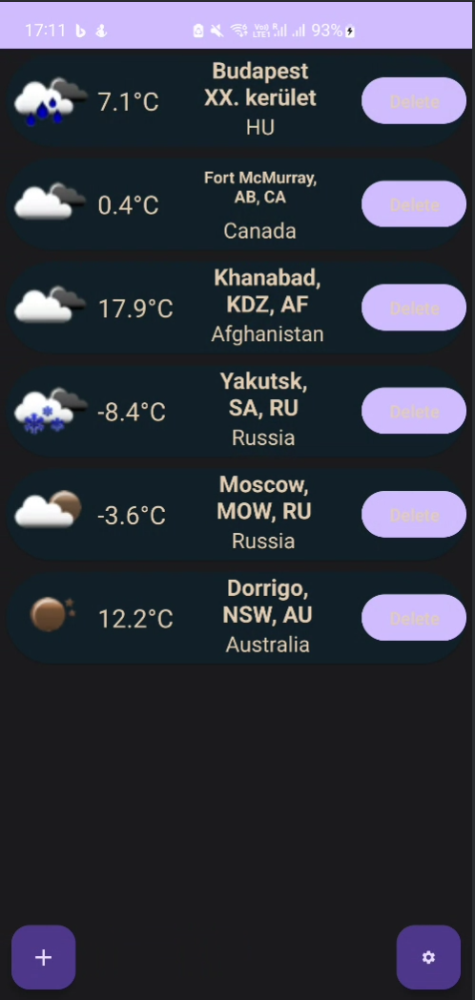
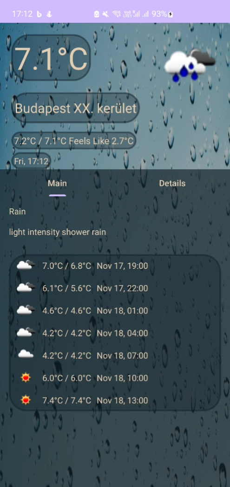
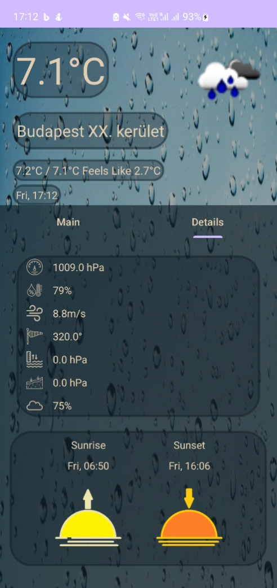
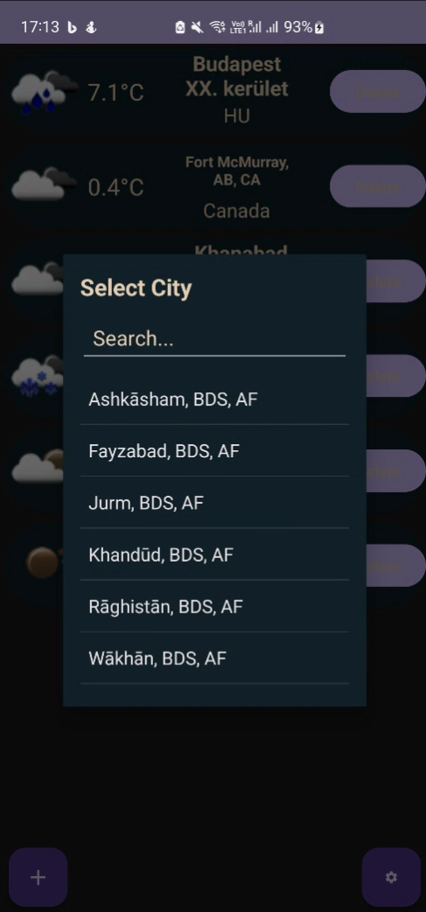

# Házi feladat specifikáció

## Mobil- és webes szoftverek
### 2023 november 15.
### Időjárás APP
### Fekete Álmos

## Bemutatás

Weather (Időjárás) alkalmazást tervezek készíteni, körülbelül 2-3 hete elkezdtem írni. Az ötlet úgy jött, hogy már korábban dolgoztam az openweathermap API-val, Discord boton időjárás előrejelzés funkción. Az alkalmazás kibővítésre kerülhet, egy előrejelzéssel, hogyha később nem lép fel hiba, a túl sok API hívás miatt. Kerül bele saját kép, háttérkép. (Ez utóbbi, csak akkor, hogyha tudok hozzá szerezni megfelelő méretű háttérképet, ami minden felbontáson megfelelően nézne ki.) Kerül bele animáció is, hogy jobban nézzen ki az alkalmazás.

## Főbb funkciók

Az alkalmazás egyelőre Internet, és helymeghatározást használ, ezek az engedélyek implementálva is vannak. Használ adatbázist, az elmentett városok, és helyszínek tárolására, illetve GPS-helymeghatározást is. Ezen felül a legfontosabb az az API hívás amihez szükséges az internet kapcsolat, szóval házózatot is használ. Animációkkal vannak ellátva az egyes UI elemek. Lehetőség van adatokat tárolni, illetve felvenni.

## Választott technológiák:

- UI
- Animations
- Fragments
- RecyclerView
- ViewPager
- Perzisztens adattárolás (Adatbázis)
- (GPS hely alapú helymeghatározás)(Azért van zárójelben, mert leteszteltem és nem működik a legjobban Fake GPS app alapján. A városnév nem feltétlen található meg az openweathermap.org oldalán, így az API hívás nem lenne sikeres, illetve buggos valamiért a GPS emulátor és olyan vérosokat mint például: London, vagy valami kínai város, nem jelenít meg, vagy olyan formában jeleníti meg amire az openweathermap.org nem hoz találatot.)
- Hálózati kommunikáció (API kezelés, és hívás)


# Házi feladat dokumentáció (ha nincs, ez a fejezet törölhető)
A házi feladatban nagyon sok osztály, illetve layout fel lett használva:
```
 |-- HW1
    |-- adapter
        |-- app.js
    |-- cityfileData
        |-- Cities.kt
        |-- CitiesItem.kt    
    |-- data
        |-- AppDatabase.kt
        |-- City.kt
        |-- CityDao.kt
    |-- details
        |-- DetailsMainFragment.kt
        |-- DetailsMoreFragment.kt
        |-- DetailsPgerAdapter.kt
        |-- WeatherDataHolder.kt
        |-- WeatherDetailsFragment.kt
    |-- main
        |-- HomeFragment.kt
        |-- MainActivity.kt
    |-- model
        |-- forecast
            |-- City.kt
            |-- Clouds.kt
            |-- Coord.kt
            |-- ForecastData.kt
            |-- Main.kt
            |-- Rain.kt
            |-- Sys.kt
            |-- Weather.kt
            |-- WeatherForecast.ks
            |-- Wind.kt
        |-- current
            |-- Cloud.kt
            |-- Coord.kt
            |-- MainWeatherData.kt
            |-- sys.kt
            |-- Weather.kt
            |-- WeatherData.kt
            |-- Wind.kt                
    |-- network
        |-- ForecastNetworkManager.kt
        |-- ForecastWeatherAPI.kt
        |-- NetworkManager.kt
        |-- WeatherAPI.kt
    |-- (AddCityDialogFragment.kt)    
    |-- SettingsFragment.kt    
```
***
A projektben a MainActivity-t használtam default Activity-nek. A MainActivity.kt kódját úgy írtam meg, hogy itt kéri el a szükséges engedélyeket az alkalmazás, illetve erre helyeztem fel egy Fragment-et: HomeFragment.

A HomeFragment.kt-ban valósítom meg az alap dolgokat:
* Adatbázis lehívás, mentés
* Új város hozzáadás
* Beállítás Fragment indítás
* Illetve az API hívások egyik fele

A fragment létrehozását az onCreateView illetve az onViewCreated ősfüggvény felüldefiniálásával valósítottam meg. Itt a gombok-nak a működését valósítottam meg, a beállítás gomb, illetve az új város hozzáadás gombot. Ezeken felül egy függvényt hívok meg, ami az egész lista megjelenítéséért felelős. Ez a függvény azért felelős, hogy az eszköz jelenlegi helyzetét lekérdezze koordinátákban, majd egy API hívással lekérje a jelenlegi város nevét. Ezt egy külön API hívással valósítom meg, ugyanis a felhasználói API hívás (amivel új várost tudunk hozzáadni a listához) csak város név alapján tud hozzáadni, és nem koordináta alapján. 

Miután lekérte a jelenlegi helyzetet, meghívja az initRecyclerView függvényt, ami egy külön szálon lekérdezi az adatbázisból az adatokat. (tárolt városok)
Itt minden egyes város lekérdezése után egy API hívás történik amivel lekéri az adott városnak a jelenlegi adatait. (hőmérséklet, valamint az adott időjárás ikonját)

Miután végzett a lehívásokkal megjeleníti a tárolt városokat a jelenlegi hőmérséklettel illetve az adott városon a jelenlegi időjárás ikonjával.

A további működéshez szükséges felüldefiniálni az onCitySelected függvényt, ami azért felelős, hogyha a felhasználó egy adott városra kattint, akkor átnavigálja egy másik fragmentre, amin az időjárás adatokat látni lehet.

A függvény a WeatherDetailsFragment-re navigál át, ami tartalmaz egy viewPager2-t illetve a felső részben a jelenlegi időjárás adatokat. A viewPager2-re 2 további fragment van rárakva.: DetailsMainFragment, illetve DetailsMoreFragment. Alapból a DetailsMainFragment jelenik meg, illetve lapozni lehet a DetailsMoreFragment-re.

A HomeFragment-ről egy függvénnyel navigált át a jelenlegi fragmentre, viszont előtte eltárolta a város nevét. Ezzel a névvel elvégezzük az API hívást, ami a loadWeatherData függvényben történik meg. A hálózati hívásban eltárolom az adatokat amiket később a viewPager2 fragmenteken fogok megjeleníteni.

A DetailsMainFragment companion object-ében az előbbiekben eltároltam az időjárás adatokat. Most viszont ez azért lett eltárolva, hogy ezen a fragment-en meg lehessen jeleníteni. Ezen felül mégegy hálózati hívást végzek ezen a fragment-en, ez egy előrejelző hálózati API hívás lesz, amivel le lehet kérdezni az előrejelzéseket is. Ezek 3 órás időintervallumban történnek. (7 előrejelzett adatot jelenítek meg, mindegyik között 3 órás különbség van) Az előrejelző hálózati hívásért a loadForecastWeatherData függvény felelős.

A DetailsMoreFragment-en hasonló képpen jelenítettem meg a jelenlegi időjárás adatokat is.

## Itt látható egy pár kép a végső alkalmazásról
, 
, 